<picture>
  <source media="(prefers-color-scheme: dark)" srcset="assets/header-dark.svg">
  <source media="(prefers-color-scheme: light)" srcset="assets/header-light.svg">
  
</picture>

  <a href="https://t.me/alalch"><strong>Telegram</strong></a> ·
  <a href="mailto:sasha.checkulin@gmail.com">Email</a> ·
  <a href="PROJECTS.md">Project details (RU)</a> ·
  <a href="README.md">Русский</a>

I build SaaS platforms, AI services and business automations, covering backend, databases, web interfaces and deployment on Linux. My projects involve content generation, advertising analytics, booking systems and Telegram apps.

I like working through the whole process: what the user needs, how the system recovers when an external API fails, and how much each operation costs.

## Selected work

| Project | My contribution | Stack |
| --- | --- | --- |
| **[LANDAX.AI](https://landax.ai/)** · Progressima | SaaS for landing-page localization and adaptation. Secure ZIP processing, AI integrations, SSH/SFTP delivery, RBAC, billing, per-user cost tracking and Binom analytics. Interface in 6 languages | Python, FastAPI, PostgreSQL, Celery, Redis, Airflow, Jinja2, JavaScript |
| **AvatarAI** · Progressima | AI video pipeline: scripts, storyboards, scenes, voice, subtitles and final assembly. Videos of 6–180 seconds. Background workers, persisted task state, recovery and safeguards against duplicate paid requests | Python, FastAPI, PostgreSQL, LLM APIs, FFmpeg, SoX |
| **[Cliparium, Kairo, Channeloom](https://github.com/AlexChek51/Mini_Apps)** · Progressima | Three independently deployable Telegram Mini Apps: media editing, planning and channel management. initData verification, tenant isolation, idempotency, concurrent workers and 18 database migrations | FastAPI, aiogram, PostgreSQL, Redis, JavaScript, Docker Compose |
| **DIKIDI × YCLIENTS** · independent client work | Booking and calendar-block synchronization, Telegram/MAX notifications and web administration. Conflict checks, dry runs and service monitoring on Linux/Raspberry Pi | Python, REST APIs, HTML, CSS, JavaScript, Docker |
| **ZONT** · independent client work | Salon website, YCLIENTS catalog with 16 categories and 142 services, browser-side visual editor with preview, drafts and undo/redo | React, TypeScript, Vite, Fluent UI, native CSS |
| **SUN MUSE** · independent client work | Studio website, YCLIENTS booking, content editor and deployment alongside the integration services | HTML, CSS, Vanilla JavaScript, Python |
| **Personal portfolio** · in development | Interactive 3D portfolio and AI media tools, including background removal and 3D experiments. Public link to follow after deployment | Next.js, React, TypeScript, CSS Modules, Three.js, ONNX Runtime Web |

## Stack and workflow

<picture>
  <source media="(prefers-color-scheme: dark)" srcset="assets/stack-dark.svg">
  <source media="(prefers-color-scheme: light)" srcset="assets/stack-light.svg">
  
</picture>

- **Backend and data:** Python, FastAPI, Pydantic, asyncio, PostgreSQL, SQLAlchemy, Alembic, Redis, Celery, Airflow, aiogram.
- **Frontend:** HTML5, CSS3, JavaScript, TypeScript, React, Next.js, Vite, Jinja2, Bootstrap, CSS Modules.
- **AI and media:** OpenAI API, Gemini, ComfyUI/Flux, FastGen, Faster Whisper, FFmpeg, SoX, ONNX Runtime Web.
- **3D and motion:** Three.js, React Three Fiber, WebGL, GLSL, GLB/glTF, GSAP, Motion.
- **Infrastructure:** Linux, Docker/Compose, Nginx, Caddy, systemd, HTTPS, Cloudflare Tunnel, SSH/SFTP, Bash, PowerShell.
- **Quality:** Git, pytest, unittest, Playwright, Ruff, mypy, ESLint, Prettier.

I use Cursor, Codex, Claude through Cursor, existing MCP tools and Skills. I delegate scoped tasks to subagents and check their output through code review, tests, builds and user flows.

I also handle deployment and troubleshooting: reverse proxies, certificates, persistent volumes, health checks, PostgreSQL connections and background queues. Earlier work includes Python/JavaScript/C++ software for Raspberry Pi under Debian, networking with MikroTik, Synology storage and backups.

## Public repositories

**[Mini Apps](https://github.com/AlexChek51/Mini_Apps)** — source code for Cliparium, Kairo and Channeloom, with interface screenshots, local previews, Docker and quality checks.

**[TrendHijackBot](https://github.com/AlexChek51/TrendHijackBot)** — regional trend research in Telegram, with source collection, OpenAI analysis, PostgreSQL history and DOCX reports. Includes tests, Docker and GitHub Actions.

Earlier AI work: **[Book Annotator](https://github.com/AlexChek51/Book_Annotator)** for book summaries and Q&A, and **[Wiki QA](https://github.com/AlexChek51/Wiki_QA)** for knowledge graphs and Wikipedia-based answers.

The public repositories include earlier learning projects. They do not represent the full stack of my commercial work.

---

**Contact:** [@alalch](https://t.me/alalch) · [sasha.checkulin@gmail.com](mailto:sasha.checkulin@gmail.com)
