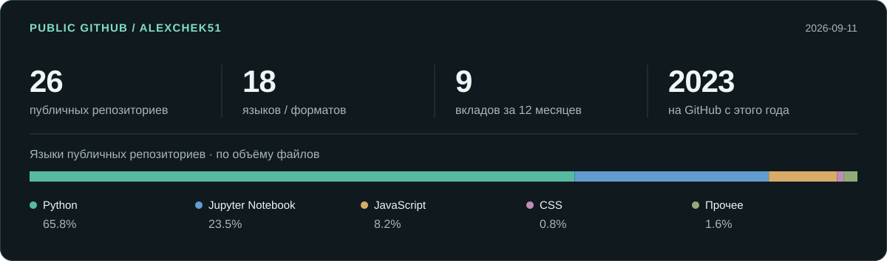

<picture>
  <source media="(prefers-color-scheme: dark)" srcset="assets/header-dark.svg">
  <source media="(prefers-color-scheme: light)" srcset="assets/header-light.svg">
  
</picture>

  <a href="https://t.me/alalch"><strong>Telegram</strong></a> ·
  <a href="mailto:sasha.checkulin@gmail.com">Email</a> ·
  <a href="PROJECTS.md">Подробнее о проектах</a> ·
  <a href="https://github.com/AlexChek51/TrendHijackBot">Открытый код</a> ·
  <a href="README.en.md">English</a>

Разрабатываю SaaS-платформы, AI-сервисы и автоматизацию для бизнеса. Беру на себя backend, базы данных, интерфейс и запуск на Linux-сервере. В проектах работаю с генерацией контента, рекламной аналитикой, CRM и Telegram-приложениями.

Мне интересны задачи, где нужно разобраться в процессе целиком: как пользователь получит результат, что произойдёт при сбое внешнего API и сколько будет стоить выполнение операции.

## Избранные проекты

<table>
<tr>
<td width="50%" valign="top">

### [LANDAX.AI ↗](https://landax.ai/)
**SaaS для рекламных лендингов · ООО «Прогрессима»**

Локализация и переработка лендингов с AI. Безопасная обработка ZIP, доставка по SSH/SFTP, роли и права, биллинг, учёт токенов и затрат по пользователям. Аналитика Binom через Airflow. **6 языков интерфейса.**

`Python` `FastAPI` `PostgreSQL` `Celery` `Redis` `Jinja2` `JavaScript`

</td>
<td width="50%" valign="top">

### AvatarAI
**Производство AI-видео · ООО «Прогрессима»**

От сценария и раскадровки до генерации сцен, озвучки, субтитров и сборки. Ролики **6–180 секунд**. Фоновые процессы сохраняют состояние и идентификаторы операций, чтобы восстанавливать задачи и предотвращать повторные платные запросы.

`Python` `FastAPI` `PostgreSQL` `LLM API` `FFmpeg` `SoX`

</td>
</tr>
<tr>
<td width="50%" valign="top">

### [Cliparium · Kairo · Channeloom ↗](https://github.com/AlexChek51/Mini_Apps)
**Telegram Mini Apps · ООО «Прогрессима»**

**3 независимо разворачиваемых продукта:** медиаредактор, планировщик и кабинет управления каналами. Проверка Telegram initData, изоляция данных клиентов, идемпотентность и конкурентные worker-процессы. 18 миграций БД; Docker Compose, Nginx и Cloudflare Tunnel.

`FastAPI` `aiogram` `PostgreSQL` `Redis` `JavaScript` `Docker Compose`

</td>
<td width="50%" valign="top">

### DIKIDI × YCLIENTS
**Синхронизация записей · отдельный заказной проект**

Объединение записей и календарных блокировок двух систем, уведомления в Telegram/MAX, web-admin. Планирование изменений, проверка конфликтов, dry-run и повторные запуски. Развёртывание на Linux/Raspberry Pi и мониторинг состояния сервисов.

`Python` `REST API` `HTML5` `CSS3` `JavaScript` `Docker`

</td>
</tr>
</table>

### Сайты и интерфейсы

| Проект | Что разработал | Стек |
| --- | --- | --- |
| **ZONT** · заказной проект | Сайт салона, каталог из 16 категорий и 142 услуг YCLIENTS, клиентский визуальный редактор с preview, черновиками и undo/redo | React, TypeScript, Vite, Fluent UI, Native CSS, CSS Custom Properties |
| **SUN MUSE** · заказной проект | Сайт студии с записью через YCLIENTS и административным редактором контента; публикация в общей Docker-инфраструктуре | HTML5, CSS3, Vanilla JavaScript, Python |
| **Сайт-портфолио** · собственный проект | Интерактивное 3D-портфолио и AI-инструменты: генерация медиа, удаление фона, работа с 3D. Публичная ссылка появится после запуска | Next.js, React, TypeScript, CSS Modules, Global CSS, Three.js, ONNX Runtime Web |

[Архитектура, личный вклад и технические решения →](PROJECTS.md)

## Технологии

| Направление | Использую в проектах |
| --- | --- |
| **Backend и данные** | Python, FastAPI, Pydantic, asyncio, REST API, SQL, PostgreSQL, SQLAlchemy, Alembic |
| **Фоновые задачи и боты** | Celery, Redis, Airflow, aiogram, Telegram Bot API, Telegram Mini Apps |
| **Frontend** | HTML5, CSS3, JavaScript, TypeScript, React, Next.js, Vite, Jinja2, Bootstrap, CSS Modules |
| **AI и медиа** | OpenAI API, Gemini, ComfyUI / Flux, FastGen, Faster Whisper, FFmpeg, SoX, ONNX Runtime Web |
| **3D и анимация** | Three.js, React Three Fiber, WebGL, GLSL, GLB / glTF, GSAP, Motion |
| **Серверы** | Linux, Docker / Compose, Nginx, Caddy, systemd, HTTPS / Let's Encrypt, Cloudflare Tunnel, SSH / SFTP, Bash, PowerShell |
| **Качество и инструменты** | Git, pytest, unittest, Playwright, Ruff, mypy, ESLint, Prettier |

**AI в разработке.** Работаю с Cursor и Codex, использую Claude через Cursor, подключаю готовые MCP-инструменты и Skills. Распределяю отдельные задачи между субагентами, задаю контекст и проверяю результат через review, тесты, сборку и пользовательские сценарии.

**Эксплуатация.** Настраиваю reverse proxy, HTTPS, persistent volumes, health checks и удалённый деплой. Разбираю сбои контейнеров, PostgreSQL, очередей и внешних API. Есть опыт с Raspberry Pi, MikroTik, Synology, резервным копированием и защищённым удалённым доступом.

<strong>Как пришёл к этому стеку</strong>

Мой опыт начинался с инженерных задач, автоматизации и преподавания информатики. Преподавал Python и робототехнику, сопровождал учебные проекты. Изучал AI в The Founder, участвовал в разработке ассистента для суммаризации бизнес-книг на стажировке в ООО «Цифровые технологии».

Также работал в МТС и промышленной автоматизации. В ранних ML- и учебных проектах использовал pandas, scikit-learn, PyTorch, TensorFlow / Keras, OpenCV, Hugging Face, Google Colab и CUDA.

В ООО «Вершина» разрабатывал прикладное ПО на Python, JavaScript и C++ для Raspberry Pi под Debian, работал с оборудованием, платёжными модулями и сетевой инфраструктурой. В ООО «Прогрессима» сосредоточился на fullstack-разработке, SaaS и AI-интеграциях. Параллельно выполнял отдельные коммерческие заказы и развивал собственные проекты.

## Открытый код

**[Mini Apps](https://github.com/AlexChek51/Mini_Apps)** — исходный код Cliparium, Kairo и Channeloom, скриншоты интерфейсов, локальный просмотр, Docker и проверки качества.

**[TrendHijackBot](https://github.com/AlexChek51/TrendHijackBot)** — Telegram-бот для исследования региональных трендов: сбор материалов, анализ через OpenAI, история в PostgreSQL и DOCX-отчёты. В репозитории есть тесты, Docker и GitHub Actions.

Ранние AI-проекты: **[Book Annotator](https://github.com/AlexChek51/Book_Annotator)** — суммаризация и вопросы по книгам; **[Wiki QA](https://github.com/AlexChek51/Wiki_QA)** — граф знаний и ответы по материалам Wikipedia.

## GitHub в цифрах

<picture>
  <source media="(prefers-color-scheme: dark)" srcset="assets/stats-dark.svg">
  <source media="(prefers-color-scheme: light)" srcset="assets/stats-light.svg">
  
</picture>

Языки рассчитаны по объёму файлов публичных репозиториев, без forks и этого профиля. Здесь есть ранние учебные notebooks; коммерческий стек приведён выше. Активность — из публичного календаря GitHub за последние 12 месяцев. [Как обновляются данные](PROFILE_MAINTENANCE.md).

---

**Обсудить проект или вакансию:** [@alalch](https://t.me/alalch) · [sasha.checkulin@gmail.com](mailto:sasha.checkulin@gmail.com)

